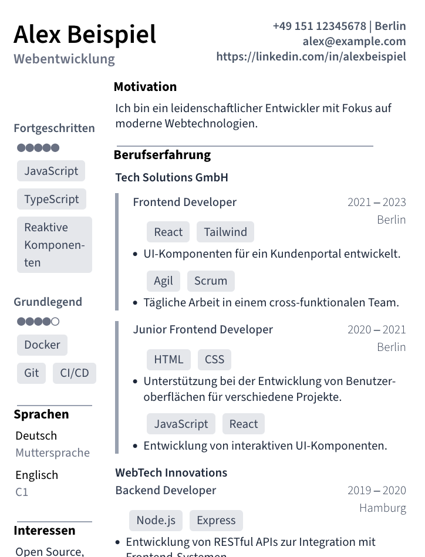

# Lebenslauf Vorlage

Einfache, modulare Lebenslauf-Vorlage, gebaut mit Next.js und React. Damit kannst du das Layout deines Lebenslaufs einfach ändern, ohne jede Zeile manuell bearbeiten zu müssen. Der Inhalt ist von der Anwendung getrennt, sodass er leicht über YAML bearbeitet werden kann, ohne Änderungen am Code vorzunehmen. Funktionen umfassen:

- Einfache Anpassung von Lebenslauf-Daten
- Mehrsprachigkeit für verschiedene Sprachversionen

Die Anwendung kommt mit Mock-Daten, die es einfach machen, den Lebenslauf auszuprobieren. Sie ist sowohl für den Druck optimiert als auch mit einem responsiven CSS-Layout ausgestattet.

## Beispiel

Hier ein Beispiel, wie der Lebenslauf aussehen könnte:



Du kannst die Vorlage nach deinen Wünschen anpassen und die Änderungen sofort im Browser sehen.

## Verwendung

1. **Installiere die Abhängigkeiten**:

   ```bash
   npm install
   ```

2. **Starte den Entwicklungsserver**:

   ```bash
   npx next dev
   ```

   Dein Lebenslauf wird unter `http://localhost:3000/<lang>` verfügbar sein, wobei `<lang>` in den Mock-Daten `en` oder `de` sein kann.[(\*)](#fußnote)

3. **Daten bearbeiten**:

   - Die Lebenslauf-Daten werden in der Datei `data.yaml` gespeichert. Du kannst diese Datei anpassen, um deinen Lebenslauf zu personalisieren. Wenn keine Daten vorhanden sind, wird `tests/data.yaml` als Beispiel-Datenquelle verwendet.
   - Die Sprachenliste wird in `app/anzeige-sprachen.json` definiert.
   - Die Etiketten für die Sektionen werden in `app/etiketten.yaml` gespeichert.

4. **Generierung einer HTML-Seite**:
   Der Lebenslauf wird als HTML-Seite generiert, die du einfach als URL teilen oder für den Druck vorbereiten kannst.

## Projektstruktur

```
/lebenslauf-vorlage
├── /app                      # React-Komponenten, Seiten und Logik
│ ├── /components             # Komponenten für Layout und Darstellung
│ ├── /parse                  # Daten werden aus YAML-Dateien gelesen
│ ├── /[lang]                 # Next.js Seiten für jede Sprache
│ ├── /anzeige-sprachen.json  # Die Sprachenliste
│ ├── /etiketten.yaml         # Die Beschriftungen für die Sektionen
│ ├── /schema.js              # Das Schema für die Lebenslauf-Daten
├── /data.yaml                # Deine persönlichen Lebenslauf-Daten
├── /tests/data.yaml          # Beispiel-Mock-Daten
/globals.css                  # Einige CSS / Tailwind Utilities
```

## Zukunftspläne

- **Für die Verwendung als veröffentlichte Website**: Persönliche Angaben einschränken und die E-Mail durch einen Kontaktformular-Link ersetzen.
- **Synchronisierung von Lebenslauf-Daten** aus LinkedIn oder anderen Quellen.

## Lizenz

Dieses Projekt steht unter der MIT-Lizenz. Weitere Informationen findest du in der [LICENSE](LICENSE)-Datei.

## Fußnote

(\*) Die Stamm-URL wird nicht direkt unterstützt, da sie in Hosting-Optionen wie **Netlify** weitergeleitet wird, die die Anfrage basierend auf der Sprache im **HTTP-Header** an den entsprechenden Sprachpfad weiterleiten. Das ist der Grund, warum die Pfade `/<lang>` (z. B. `/de`, `/en`) ausreichen.
